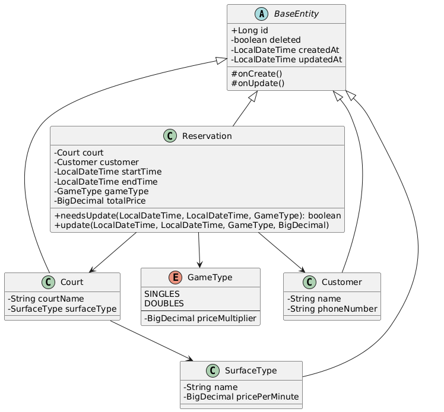

# Tennis Club Management System


A RESTful API for managing tennis court reservations, customers, and surface types in a tennis club.

## Features

- **Court Management**
   - Create, update, and delete courts
   - Find courts by surface type
   - Soft delete functionality

- **Reservation System**
   - Book court time slots
   - Prevent overlapping reservations
   - Validate reservation times
   - Calculate pricing based on surface type and duration

- **Customer Management**
   - Register and manage customers
   - Find customers by phone number
   - View customer reservations

- **Surface Types**
   - Manage different court surfaces (clay, grass, hard etc.)
   - Set pricing per minute for each surface


## Building and Running the Application

### Prerequisites
- Java 21 or higher
- Spring Boot 3.4.4

### Build the Project
```bash
mvn clean install
```

### Run the Application
```bash
mvn spring-boot:run
```

### test
```bash
mvn test
```


## API Documentation

### Endpoints

#### Courts
- `POST /courts` - Create new court
- `GET /courts` - List all courts
- `GET /courts/{id}` - Get court by ID
- `GET /courts/surface-types/{surfaceTypeName}` - Find courts by surface type
- `PUT /courts/{courtName}` - Update court
- `DELETE /courts/{courtName}` - Delete court by name
- `DELETE /courts/id/{id}` - Delete court by ID

#### Reservations
- `POST /reservations` - Create new reservation
- `GET /reservations` - List all reservations
- `GET /reservations/{phoneNumber}` - Get reservations by customer phone
- `GET /reservations/court/{courtName}` - Get reservations by court
- `PUT /reservations/{id}` - Update reservation
- `DELETE /reservations/{id}` - Cancel reservation

#### Customers
- `POST /customers` - Register new customer
- `GET /customers` - List all customers

#### Surface Types
- `POST /surface-types` - Create new surface type
- `GET /surface-types` - List all surface types
- `GET /surface-types/{id}` - Get surface type by ID
- `DELETE /surface-types/{id}` - Delete surface type

## Error Handling

The API returns standardized error responses:

```json
{
  "title": "Error Title",
  "detail": "Detailed error message",
  "errorCode": "ERROR_CODE",
  "status": 400
}
```
### Example Error Response
```json
{
  "title": "Invalid Reservation",
  "detail": "The reservation time overlaps with an existing reservation.",
  "errorCode": "RESERVATION_OVERLAP",
  "status": 400
}
```


## Common error codes:
- `RESERVATION_OVERLAPS` - When new reservation conflicts with existing one
- `RESERVATION_INVALID_TIME` - When end time is before start time
- `COURT_NOT_FOUND` - When court doesn't exist
- `CUSTOMER_ALREADY_EXISTS` - When phone number is already registered


## CLASS diagram


## License

This project is licensed under the [MIT License](LICENSE).

---

### Contact

For inquiries or support, please reach out to [onadebt](https://github.com/onadebt).